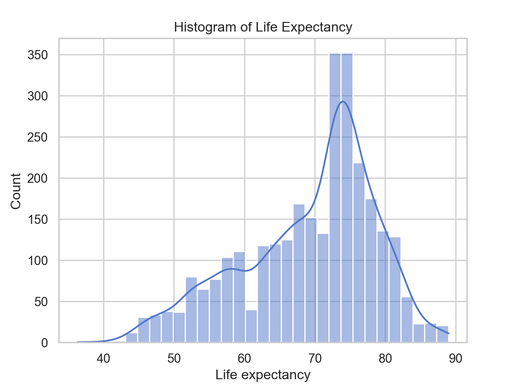
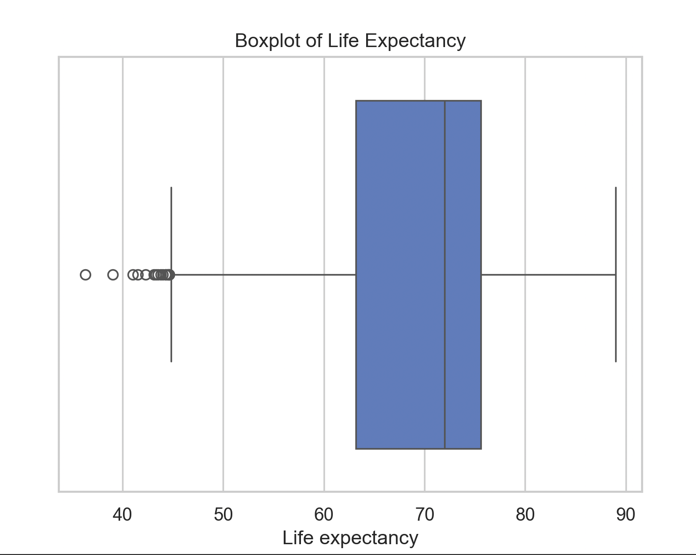
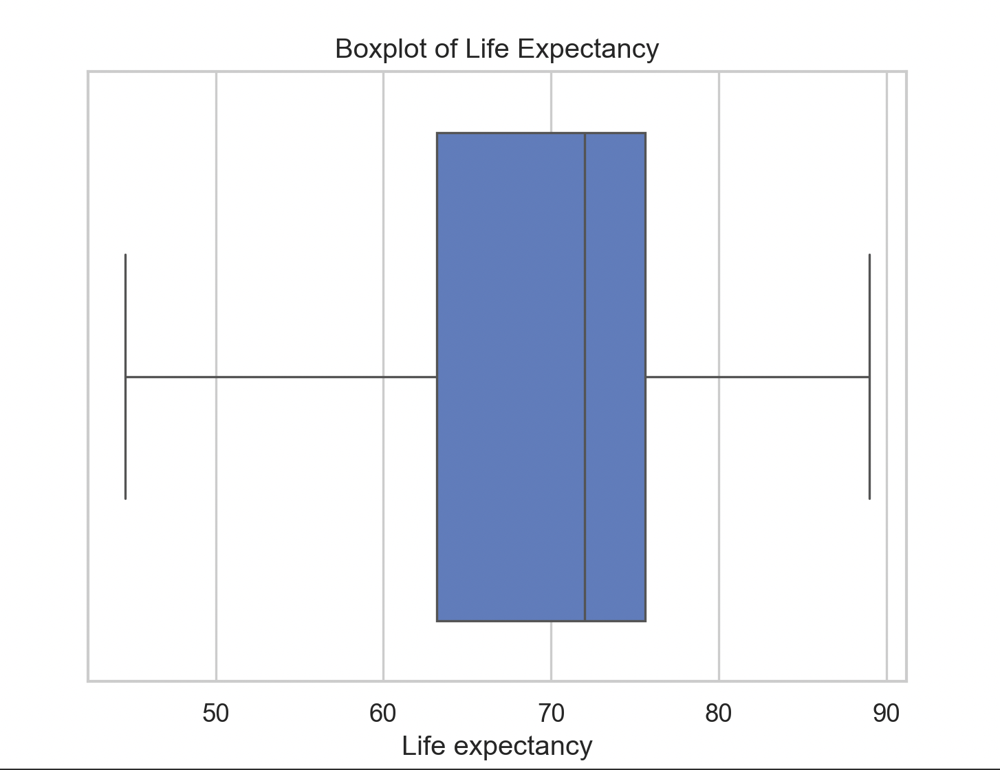
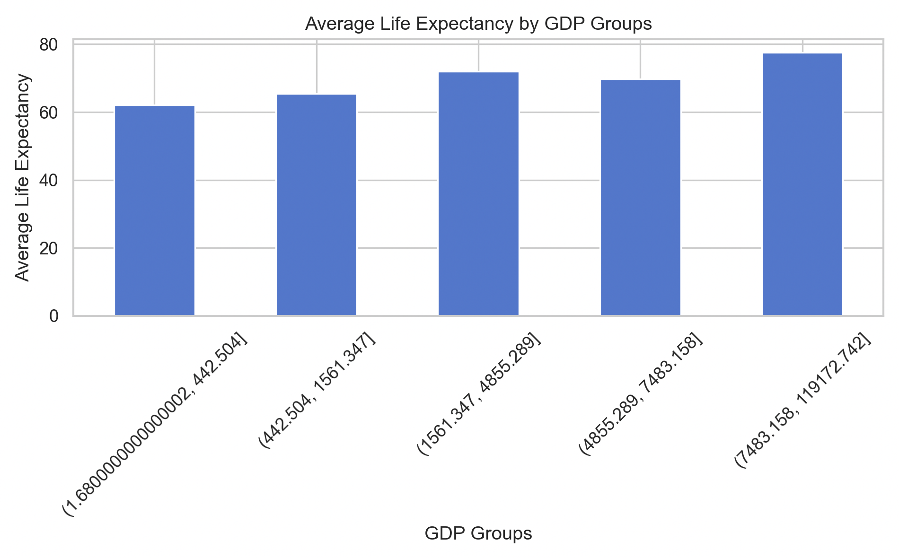
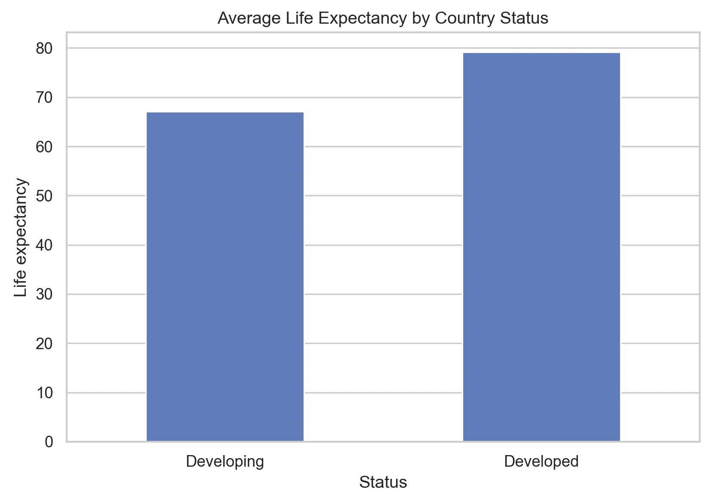
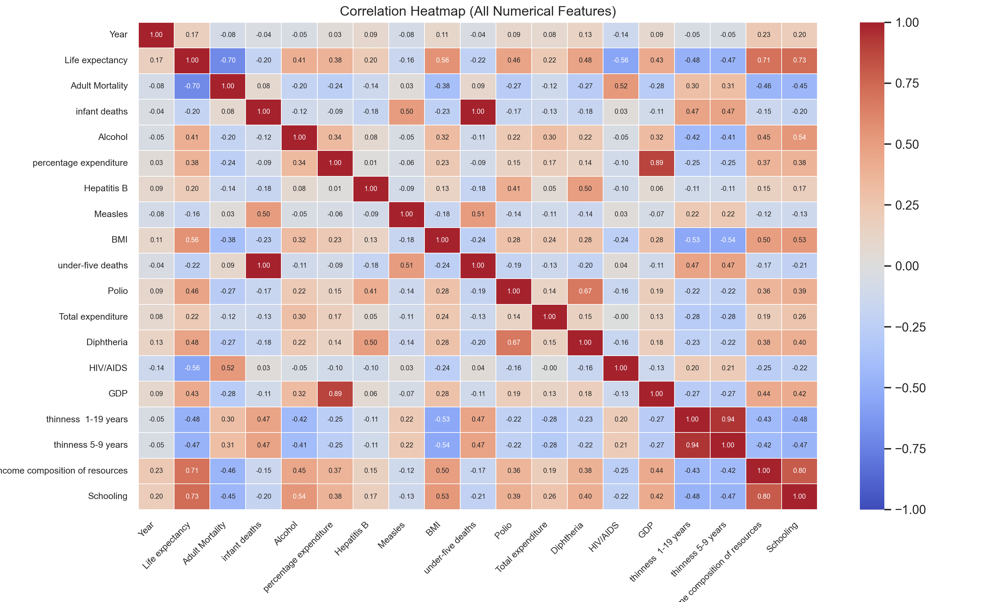
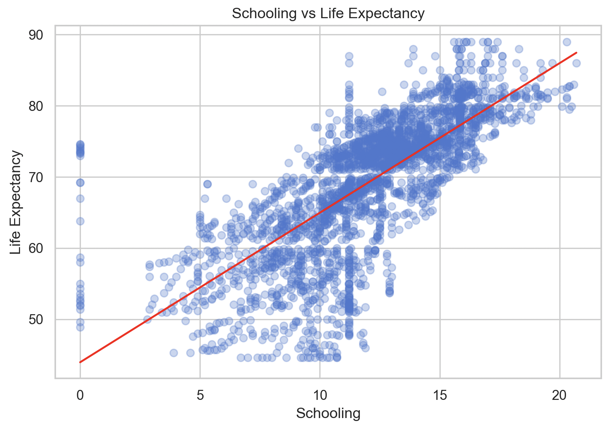
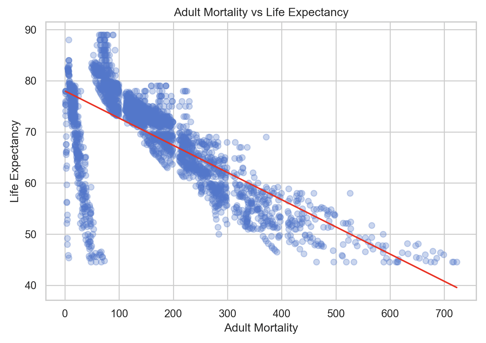
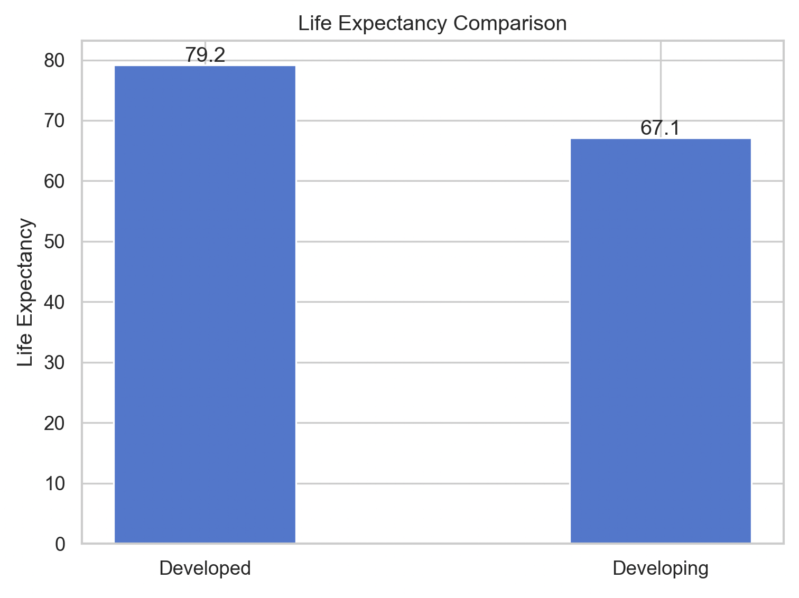

# life_expectancy_analysis

End-to-end data analysis of WHO Life Expectancy dataset using Python, including EDA, data cleaning, visualization, regression modeling, and statistical hypothesis testing.

---

## 📌 Project Objectives

- Analyse the impact of **Schooling** on Life Expectancy using linear regression  
- Analyse the impact of **Adult Mortality** on Life Expectancy using linear regression  
- Analyse how Life Expectancy varies across **GDP groups** using a bar plot  
- Compare Life Expectancy between **Developed and Developing countries** using a bar plot  
- Identify key factors affecting Life Expectancy using correlation analysis of all numerical features  

---

## 📊 Exploratory Data Analysis (EDA)

This stage focuses on understanding the **distribution, variability, and hidden patterns** in the dataset before building predictive models.

---

## 📉 Normality Check — Life Expectancy

### 📌 What the Plot Shows

- Distribution of life expectancy across countries  
- Majority of values lie between **65–80 years**  
- The distribution is **negatively skewed (left-skewed)**  

---

### 📌 Detailed Analysis

The histogram indicates that most countries have relatively high life expectancy, while a smaller number of countries fall in the lower range. The left skew suggests that a few underperforming countries significantly pull the distribution downward.

The concentration around 70–75 years represents the global average, while the lower tail reflects countries with poor healthcare infrastructure, higher disease burden, and limited socio-economic development.

---

### 🎯 Insight

> Life expectancy is not evenly distributed — global inequality exists where a small group of countries significantly lags behind.

---

## 📊 Outlier Detection — Boxplot

### 📌 What the Plot Shows

- Median around **70+ years**  
- Several extreme values on the lower side  

---

### 📌 Detailed Analysis

The presence of multiple lower-end outliers indicates countries with extremely low life expectancy. These points are far from the central distribution and can distort statistical models if left untreated.

This highlights inequality in global health conditions and the existence of extreme cases.

---

### 🎯 Insight

> Extreme values can bias analysis and reduce model reliability if not handled properly.

---

## 📊 Outlier Treatment (IQR Method)

### 📌 What the Plot Shows

- Outliers are no longer extreme  
- Distribution becomes more stable  

---

### 📌 Detailed Analysis

Outliers were capped using the IQR method, ensuring that extreme values do not dominate the analysis. Importantly, the median remains unchanged, meaning the core data structure is preserved.

This improves statistical reliability while maintaining data integrity.

---

### 🎯 Insight

> Proper outlier handling ensures models learn general trends rather than rare extreme cases.

---

## 📊 Data Visualisations

---

### 🔹 Bar Plot — GDP Groups vs Life Expectancy

### 📌 What the Plot Shows

- Countries are divided into **GDP-based quantile groups**
- Each bar represents the **average life expectancy** within each economic group

---

### 📌 Detailed Analysis

The plot clearly demonstrates a **gradual increase in life expectancy as GDP increases**, indicating a positive association between economic status and health outcomes. Countries in lower GDP groups tend to have lower life expectancy, which reflects limited access to healthcare, poor nutrition, and weaker infrastructure.

As we move toward higher GDP groups, life expectancy improves and becomes more stable. However, the increase is not perfectly linear — some overlap between groups suggests that GDP alone does not fully determine life expectancy.

This implies that while wealth contributes to better living conditions, it must be complemented by factors such as education, healthcare systems, and public policy.

---

### 🎯 Objective Connection

This visualization directly addresses the objective:
> *Analyse how Life Expectancy varies across GDP groups*

It shows that **economic development improves life expectancy**, but is not the most dominant or consistent predictor.

---

### 🎯 Insight

> GDP positively influences life expectancy, but its impact is limited compared to education and health-related factors.

---

### 🔹 Bar Plot — Developed vs Developing Countries

### 📌 What the Plot Shows

- Compares the **average life expectancy** between developed and developing countries

---

### 📌 Detailed Analysis

The plot highlights a **significant gap in life expectancy** between developed and developing nations. Developed countries show higher average values, indicating stronger healthcare systems, better education, improved sanitation, and higher standards of living.

In contrast, developing countries display lower averages and more variability, reflecting inconsistent access to healthcare and economic instability.

This difference is not just visual but also reflects structural inequalities in global health systems.

---

### 🎯 Objective Connection

This directly satisfies the objective:
> *Compare Life Expectancy between Developed and Developing countries*

It provides clear evidence that **development status plays a crucial role in determining population health outcomes**.

---

### 🎯 Insight

> Development level is one of the strongest real-world indicators of life expectancy due to combined socio-economic advantages.

---

### 🔹 Heatmap — Correlation Analysis (All Numerical Features)

### 📌 What the Plot Shows

- Displays correlations between **all numerical variables** in the dataset  
- Values range from **-1 (strong negative)** to **+1 (strong positive)**  

---

### 📌 Detailed Analysis

The heatmap provides a **comprehensive overview of relationships across all variables**, allowing us to identify the most influential predictors of life expectancy.

Key observations include:

- **Strong positive correlation with Schooling**
  - Indicates that higher education levels significantly improve health outcomes

- **Strong negative correlation with Adult Mortality**
  - Confirms that higher mortality rates directly reduce life expectancy

- **Moderate correlations with GDP and economic factors**
  - Suggest that economic growth contributes to better outcomes but is less consistent

- **Weak correlations with some variables**
  - Indicate limited direct influence on life expectancy

This holistic view helps distinguish between **primary drivers and secondary contributors**.

---

### 🎯 Objective Connection

This directly fulfills the objective:
> *Identify key factors affecting Life Expectancy using correlation analysis of all numerical features*

It enables us to **prioritize variables** based on their strength of relationship.

---

### 🎯 Insight

> While many variables contribute to life expectancy, **education and mortality are the most dominant and reliable predictors**, whereas economic factors alone are insufficient.

---

## 📈 Linear Regression Models

---

### 🔹 Model 1 — Schooling vs Life Expectancy

### 📌 Detailed Analysis

A strong positive linear relationship is observed. The close alignment of data points with the regression line indicates low variability and strong predictive power.

This confirms that higher education leads to better health awareness, improved lifestyle, and increased access to healthcare.

---

### 🎯 Objective Connection

> Analyse the impact of Schooling on Life Expectancy  

---

### 🎯 Insight

> Schooling is one of the strongest predictors of life expectancy.

---

### 🔹 Model 2 — Adult Mortality vs Life Expectancy

### 📌 Detailed Analysis

The regression plot reveals a **strong negative linear relationship** between adult mortality and life expectancy. As mortality increases, life expectancy decreases sharply.

The tight alignment of data points with the regression line indicates a strong and consistent relationship, suggesting that mortality is a direct and powerful determinant of lifespan.

---

### 🎯 Objective Connection

This fulfills the objective:
> *Analyse the impact of Adult Mortality on Life Expectancy using linear regression*

The model clearly demonstrates that **mortality has a direct and significant negative impact**.

---

### 🎯 Insight

> Adult mortality is one of the most critical indicators of population health and strongly influences life expectancy.

---

## 🧪 Hypothesis Testing

---

### 🔹 Hypothesis

- **H₀ (Null Hypothesis):** There is no significant difference in life expectancy between developed and developing countries  
- **H₁ (Alternative Hypothesis):** Developed countries have higher life expectancy than developing countries  

---

### 🔹 Methodology

- **Test Used:** Welch’s Independent T-Test  
- **Why this test?**
  - It compares the means of two independent groups  
  - It does **not assume equal variances**, making it suitable for real-world data  
- **Significance Level (α):** 0.05  

---

### 📌 What the Test Does

The hypothesis test evaluates whether the observed difference in average life expectancy between developed and developing countries is **statistically significant** or could have occurred by chance.

It calculates:
- The **difference in means**
- The **T-statistic**
- The **P-value**, which determines significance  

---

### 📌 Detailed Analysis

The results show that:

- The **average life expectancy of developed countries is higher** than that of developing countries  
- The **P-value is less than 0.05**, indicating strong statistical evidence against the null hypothesis  

This means the observed difference is **not random** but reflects a real underlying pattern in the data.

The gap in life expectancy can be attributed to:
- Better healthcare systems in developed countries  
- Higher education levels and awareness  
- Improved sanitation and nutrition  
- Stronger economic and policy support  

---

### 🎯 Objective Connection

> Compare Life Expectancy between Developed and Developing countries  

This hypothesis test provides **statistical validation** for the differences observed in the bar plot visualization, confirming that development status significantly impacts life expectancy.

---

### 🎯 Conclusion

> Reject H₀ — Developed countries have significantly higher life expectancy than developing countries.

This confirms that **development level is a key determinant of population health outcomes**.

---

### 🔹 Visualization

---

### 📌 Interpretation of Visualization

- The bar chart shows the **mean life expectancy for both groups**  
- Developed countries clearly have a higher mean value  
- The difference is visually significant and aligns with statistical results  

---

### 🎯 Insight

> Both statistical testing and visualization confirm that development status plays a crucial role in determining life expectancy, highlighting global inequality in healthcare access and living conditions.

---

## 🧠 Final Insights

- Life expectancy depends on education, healthcare, and economic conditions  
- Schooling → strongest positive factor  
- Adult Mortality → strongest negative factor  
- GDP contributes but is not sufficient  
- Developed countries show better stability  

---

## 🚀 Final Conclusion

- Education significantly improves life expectancy  
- Reducing mortality is essential for better outcomes  
- Economic growth alone is not enough  
- Data-driven insights can guide global health policy  

---
