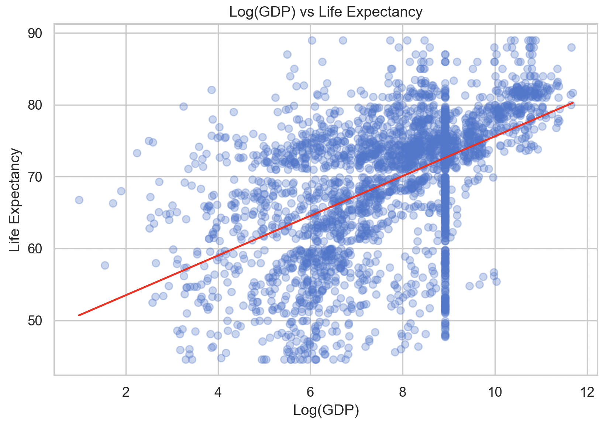

# life_expectancy_analysis

End-to-end data analysis of WHO Life Expectancy dataset using Python, including EDA, data cleaning, visualization, regression modeling, and statistical hypothesis testing.

---

## 📌 Project Objectives

1. Analyse the impact of **Schooling** on Life Expectancy using linear regression  
2. Analyse the impact of **GDP (log-transformed)** on Life Expectancy  
3. Visualise the relationship between **Adult Mortality and Life Expectancy** using a scatter plot  
4. Compare Life Expectancy between **Developed and Developing countries** using a box plot  
5. Identify key factors affecting Life Expectancy using a **correlation heatmap**

---

## 📊 Exploratory Data Analysis (EDA)

This section focuses on understanding the distribution, anomalies, and relationships within the dataset before applying predictive modeling techniques.

---

## 📉 Normality Check — Life Expectancy

### 📌 Detailed Analysis
- The distribution is **negatively skewed (left-skewed)**, meaning:
  - A large number of countries have **high life expectancy**
  - Fewer countries fall in the lower range (40–55 years)

- The peak around **70–75 years** indicates the global average cluster

- The left tail (low values) represents:
  - Underdeveloped nations
  - Poor healthcare infrastructure
  - High mortality rates

### 🎯 Insight
> Life expectancy is not evenly distributed across countries — most countries are doing reasonably well, but a small group significantly lags behind.

---

## 📊 Outlier Detection — Boxplot

### 📌 Detailed Analysis
- Multiple **outliers on the lower side** (below ~45–50 years)
- These points are far from the median (~70+), indicating:
  - Extreme inequality in global health outcomes

- The box (IQR range) is relatively tight compared to outliers:
  - Most countries fall within a stable range
  - Only a few extreme cases distort the distribution

### 🎯 Insight
> A small number of countries with very low life expectancy can heavily influence statistical models and reduce accuracy.

---

## 📊 Outlier Treatment (IQR Method)

### 📌 Detailed Analysis
- Extreme lower outliers are no longer visible
- The distribution becomes more **balanced and compact**

- Median remains stable → meaning:
  - Core data was preserved
  - Only extreme values were controlled

### 🎯 Why this matters
- Improves:
  - Regression accuracy
  - Statistical reliability
- Prevents model bias caused by extreme values

### 🎯 Insight
> Capping outliers ensures the model learns general patterns instead of being influenced by rare extreme cases.

---

## 📈 Linear Regression Models

---

### 🔹 Model 1 — Schooling vs Life Expectancy

### 📌 Detailed Analysis
- Strong **positive linear relationship**
- As schooling increases:
  - Life expectancy increases consistently

- The data points follow the regression line closely:
  - Indicates **strong correlation**
  - Low randomness → good predictive power

- Spread is tighter at higher schooling levels:
  - Developed countries show more stability

### 🎯 What this means
- Education impacts:
  - Health awareness
  - Lifestyle choices
  - Access to medical knowledge

### 🎯 Insight
> Schooling is one of the most reliable predictors of life expectancy across countries.

---

### 🔹 Model 2 — Log(GDP) vs Life Expectancy

### 📌 Detailed Analysis
- Positive relationship exists, but:
  - More **scattered than schooling**
  - Indicates weaker correlation

- Vertical clustering visible:
  - Some countries have similar GDP but different life expectancy
  - Suggests GDP alone is not sufficient

- Log transformation helped:
  - Reduce skewness
  - Improve linearity

### 🎯 What this means
- Wealth improves:
  - Healthcare infrastructure
  - Nutrition
  - Living standards

- But:
  - Not all rich countries perform equally
  - Other factors (education, policy, healthcare access) matter

### 🎯 Insight
> GDP influences life expectancy, but its impact is less consistent compared to education.

---

## 🧠 Key Analytical Insights

- Life expectancy is **clustered around higher values**, but inequality still exists  
- Outliers represent **real-world disparities** in global health  
- **Education (Schooling)** shows a stronger and more stable relationship than GDP  
- GDP requires transformation → indicates **data imbalance and economic inequality**  
- Proper preprocessing (outliers + transformation) significantly improves analysis quality  

---

## 🚀 Interim Conclusion (EDA & Regression)

- Education plays a **critical role** in improving life expectancy  
- Economic growth contributes, but is not the sole factor  
- Data cleaning and transformation significantly improve analysis quality  
- Combining multiple indicators gives better understanding of global health patterns  

---

## 🔜 Upcoming Sections

- Data Visualisations (Scatter Plot, Box Plot, Heatmap)  
- Hypothesis Testing (T-test for Developed vs Developing countries)  

---
